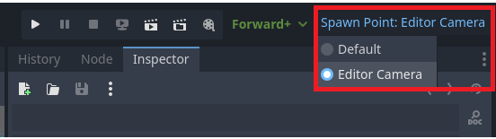

# Godot-BIMLauncher
BIM Launcher - Addon for godot enhancing launching the game from editor with additional features

# Installation

1. Copy `addons` folder from this repository to your project folder.
2. Open Project Settings, go to Plugins tab and enable `Launcher` plugin

# Features

## Option to spawn player at position of editor camera.

This adds similar feature to spawn selection in Unreal Engine, so you can spawn immediately where the camera is in editor. Useful for playtesting while designing levels.



## How to use

(This assumes the addon is properly installed!)

1. Add the following code to your player class _ready function.
```gdscript
func _ready() -> void:
	BIMSpawner.teleport_to_spawn_point(self)
```
2. select `Spawn Point: Editor Camera` and press Run or Run Current Scene


